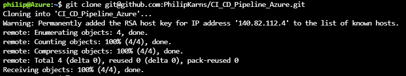

# CI_CD_Pipeline_Azure
Building a Continuous Integration and Continuous Delivery pipeline for a Flask machine learning application in Python

# Overview
This project will start with cloning a github repo in Azure Cloud Shell, followed by creating project scaffolding for Continuous Integration which includes a Makefile, requirments.txt, 
a Python Virtual Environment, a Python script and test file for the script. Then, it will use GitHub Actions to test our project when change events occur in GitHub. GitHub Actions will
automatically build our project, performing install, lint and test actions to verify our tests pass, and this step completes the Continuous Integration portion of the project. Finaly,
this project will be integrated with Azure Pipelines to enable Continuous Delivery to Azure App Service using a Flask Machine Learning API.

## Project Plan
<TODO: Project Plan

### Trello Board
https://trello.com/b/7KN3nSMa/build-devops-process-to-deploy-ml-app

### Spreadsheet with Project Plan
https://docs.google.com/spreadsheets/d/1vs-qzjjO7mzfw8u8LQUzjz72jgQyWUKWP8PfD2kf7fs/edit#gid=0

## Architectural Diagram


## Instructions
<TODO:  Instructions for running the Python project.  How could a user with no context run this project without asking you for any help.  Include screenshots with explicit steps to create that work. Be sure to at least include the following screenshots:
### Continuous Integration

#### Part 1
:white_check_mark: Create SSH Keys in Azure Cloud Shell and add to GitHub
:white_check_mark: Clone GitHub Repository
:white_check_mark: Run make all to install, lint and test the code

Click on the Azure Cloud Shell Icon in the Azure Portal


Run command ssh-keygen -t rsa to generate SSH Keys


Type command cat /home/yourAzureName/.ssh/id_rsa.pub to get your key, and then copy it, including the ssh-rsa part. For example,
as seen in the below image, my name in lowercase, philip, is listed in front of Azure at the prompt, so in the cat command I put 
/home/philip/.ssh/id_rsa.pub. 


In GitHub, click on your profile picture, then settings, then SSH and GPG keys, and then New SSH key. Paste your SSH key into
the key field and then click the Add SSH key button. 


In Azure Cloud Shell clone this repository using the SSH link git@github.com:PhilipKarns/CI_CD_Pipeline_Azure.git. After hitting enter, 
cd into the project.


Run the Make All command to install, lint, and test the code using the Makefile.


### Continuous Delivery 
:white_check_mark: Set up Virtual Environment
:white_check_mark: Create an App Service 
:white_check_mark: Verify the deployed application works
:white_check_mark: Perform a prediction

To set up the virtual environment, first enter command  python3 -m venv ~/.CI_CD_Pipeline_Azure and hit enter. Then enter command 
source ~/.CI_CD_Pipeline_Azure/bin/activate and hit enter 


To create your app service, first run command make install to install any required libraries. Then run command 
az webapp up -n yourappservicename. Your app service name has to be one that hasn't already been used. Here's mine:


Click on the URL to see your deployed app service:


To perform a prediction, first go into the make_predict_azure_app.sh file and change the app name to the one you created:


Then run command ./make_predict_azure_app.sh to get a prediction


* Successful deploy of the project in Azure Pipelines.  [Note the official documentation should be referred to and double checked as you setup CI/CD](https://docs.microsoft.com/en-us/azure/devops/pipelines/ecosystems/python-webapp?view=azure-devops).

* Running Azure App Service from Azure Pipelines automatic deployment

* Successful prediction from deployed flask app in Azure Cloud Shell.  [Use this file as a template for the deployed prediction](https://github.com/udacity/nd082-Azure-Cloud-DevOps-Starter-Code/blob/master/C2-AgileDevelopmentwithAzure/project/starter_files/flask-sklearn/make_predict_azure_app.sh).
The output should look similar to this:

```bash
udacity@Azure:~$ ./make_predict_azure_app.sh
Port: 443
{"prediction":[20.35373177134412]}
```

* Output of streamed log files from deployed application

> 

## Enhancements

<TODO: A short description of how to improve the project in the future>

## Demo 

<TODO: Add link Screencast on YouTube>

=======

>>>>>>> 55093ffc384c3972fb7a26e5b3f5fbe7e60f4d7d
